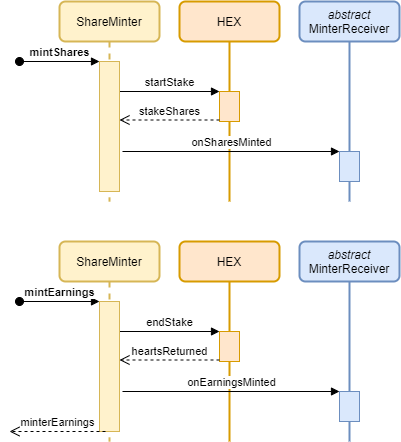
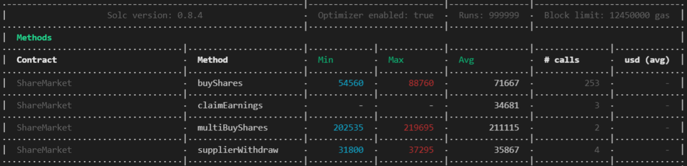

# ShareMinter ShareMarket Contracts

## Ropsten
- HEX: https://ropsten.etherscan.io/address/0xaaad01f209775a8c2413f1f0fe985e2f284a8089
- ShareMinter: https://ropsten.etherscan.io/address/0x37d241C8F1DF0ee1f201aED648E4Fbafa05868b1
- ShareMarket: https://ropsten.etherscan.io/address/0x1592Ed5c72B43DAA5d757Ee9e1970BB16f7E2179

## Mainnet
- HEX: https://etherscan.io/address/0x2b591e99afE9f32eAA6214f7B7629768c40Eeb39
- ShareMinter: 
- ShareMarket: 

<br>

_________________

## ShareMinter

### Methods
`mintShares` - Hex stakeStart and three new fields:
1. Receiver address (contract to mint shares to)
2. Supplier address (for HEX repayment)
3. Share rate premium 0-999 (0.0% - 99.9%)

`mintEarnings` - Normal hex endStake that transfers hearts earned to specified receiver address

`minterWithdraw` - If someone other than the original stake minter calls `mintEarnings` **before** the grace period ends, then the minter can later come back and withdraw his earnings.

### Share Rate Premium

The share rate premium dictates how much the minter would like to increase the cost of the shares being sent to the receiver.
```
Example
1. Call `mintShares` with 1,000,000 HEX staked and share rate premium of 1%
2. Stake creates 10T shares
3. Receiver gets 9.9T shares (1% premium = 0.1T shares)
4. Send 1,000,000 HEX staked and 9.9T shares to receiver
5. Call `mintEarnings` and minter gets 1% of HEX rewarded
6. Receiver gets 99% of the HEX rewarded

Original share price
10T Shares / 1M HEX = 10M shares per HEX

Receiver share price
9.9T shares / 1M HEX = 9.9M shares per HEX
```

### Rules

The minter (caller of the contract) is considered the custodian of the stake so these rules apply:

1. Premature end stake is disabled
2. Anyone can call `mintEarnings`
3. If no one calls `mintEarnings` within **10 days** after the unlock date, **the minter's earnings are paid to the first caller**.

### Sequence Diagram


<br>

_________________

## ShareMarket *(extends MinterReceiver)*

### Methods
`buyShares(stakeId, shareReceiver, sharesPurchased)` - Can buy shares for any address

`multiBuyShares` - Lumps hex owed into one transfer to save on gas

`claimEarnings(stakeId)` - Claim stake earnings after they have been minted to the market

`supplierWithdraw(stakeId)` - Claim stake earnings after they have been minted to the market

### Pros
1. Gas savings - `claimEarnings` costs approximately as much as an ERC20 transfer
2. Buy shares for any address
3. Don't worry about ending the stake
4. Discounted shares and ability to buy into a stake that has accrued interest already

### Cons
1. No emergency end stake
2. If the share rate premium is worth less than the cost to end stake then there's a risk it will fall on to a share owner to end it

### Gas Usage


<br>

_________________

## Setup for Development - Hardhat
1. Run `npm install` to pull in packages
2. Available commands:
```
npm run <command>
  stage
    npm run lint & npm run test & npm run docs & npm run coverage
  compile
    hardhat compile
  lint
    hardhat check
  docs
    yarn run hardhat docgen
  coverage
    hardhat coverage
```

## Setup for Rinkeby / Mainnet
1. Create a file named `.env` in the root of the project
2. Populate the file with the following properties for running the deployer:
```
PK=YOUR_PRIVATE_KEY_HERE
INFURA_API_KEY=YOUR_INFURA_API_KEY_HERE
ETHERSCAN_API_KEY=YOUR_ETHERSCAN_API_KEY_HERE
```

## Commands

### Running tests

```
npx hardhat test
```

### Deploy to Ropsten
```
npx hardhat run --network ropsten scripts/deploy_ropsten.js
```

### Deploy to Mainnet

```
npx hardhat run --network mainnet scripts/deploy_mainnet.js
```


